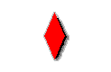
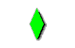
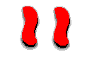
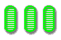
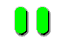
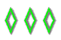
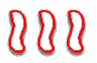

# Set (the Game)

# Instructions

## How to Play Set

Set is a game of visual perception. The idea is to form "sets" from the cards shown. Each card contains shapes with characteristics drawn from four categories. Each category contains three different possible appearances. Each card is unique, hence, there are 3^4 or 81 cards in a complete Set deck. The four categories are:

1) Color (Red, Green, or Purple)
2) Shape (Circle, Diamond, or Squiggle)
3) Number (One, Two, or Three)
4) Shading (Filled, Striped, or Empty)

For 3 cards to form a set, they must be all different or all alike within each category. To test 3 cards for a set, look at each category individually.

Are they all the same color? If not, are they all different colors? If only two cards share a color, they do not form a set. Otherwise, move on to the next category.  
Are they all the same shape? If not, are they all different shapes.
Do the same for conditions 3 and 4.

### Examples

>     
>  These cards form a set. They are alike in every category except shading, in which they are all different.

>     
>  These cards do not form a set. The category of color contains two cards that are alike, and one card that is different. 

>     
>  These cards form a set. They are different in every category.

>     
>  These cards form a set. They are all alike in color and shape, and they are all different in number and shading.

>     
>  These cards do not form a set. The categories of number and shading do not satisfy the conditions to form a set.

# Using This App~~let~~

After the images have loaded, a number of set cards like the ones in the examples above should be displayed in grid layout. Normally 12 cards are dealt out at a time; however, if these 12 cards contain no set, 3 more cards will be dealt out for a total of 15 cards on the table.

To test 3 cards for a set, select them by clicking once on each. Selected cards will display a light green border. To deselect a card, click on it again. If the three cards are indeed a set, they will be removed from the table and new cards will be dealt. If they do not form a set, your cards will be deselected for you, and you must try again. The game will continue until all 81 cards have been dealt, at which time there may be cards missing from the table. When there are no more sets, and no more cards to be dealt, the game is over. Click on "Deal Again" to start a new game.

If you are just learning how to play set, you may find it helpful to click on the "Reveal Set" button. The computer will select two of the cards in a set for you; it is up to you to find the missing third.

# About Set

If you find Set to be a lot of fun, I'd encourage you to visit the Set homepage (www.setgame.com) where you'll find an exhaustive amount of information about different variations of the game, the mathematics involved, and where you can order your own playing card deck.

## Neato

There is a chance that, even after 15 cards have been dealt, still no set exists. The chance of this happening is about 1/1000 or 0.1%. Not very likely, but enough to happen at least once a week at the rate people are visiting this page. In this case, a little window will pop up to tell you how unique this experience is. I've only dealt out 15 cards with no set just one time... so cherish the moment! You might ask yourself at this point "How many cards can I deal and still have no set? In other words, how many cards do I have to deal out to guarantee that they contain a set?" Well, see if you can find out!

# Have fun!

As Brandon McPhail intended.